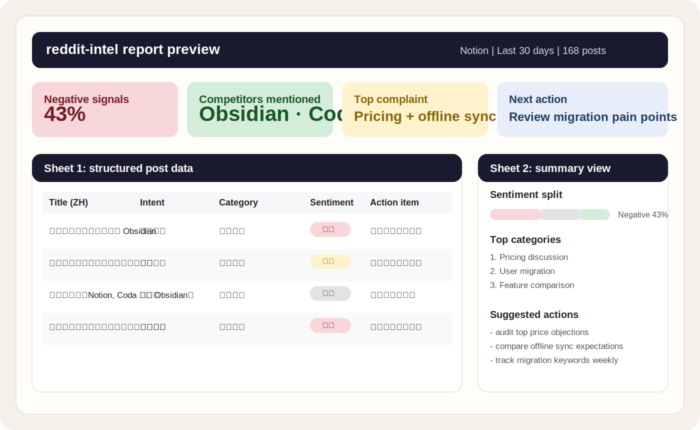

## 开源一个 Skill，把 Reddit 讨论整理成竞品分析和用户洞察情报表

它不是一个普通的 Reddit 抓取工具，而是一个把 Reddit 上分散讨论整理成**可直接汇报的双语 Excel 情报表**的 Skill。你给它一个关键词，它会抓取相关帖子和热评，完成分类、翻译、情绪判断、竞品提取和行动建议，最后输出一份适合产品、增长、品牌和市场团队直接使用的结果。

## 它解决什么问题

市面上很多 Reddit 工具有一个共同问题：  
**能抓到数据，但很难直接拿来做判断。**

要么是原始 JSON / CSV 太散，要么是 AI 总结太空，最后还是要人自己去读、自己去筛、自己去写结论。

`reddit-intel` 想解决的是中间这段最费时间的工作：

- 帮你从 Reddit 抓到相关帖子和热评
- 帮你把内容整理成结构化字段
- 帮你提取竞品、场景、情绪和行动信号
- 帮你输出成一份可直接汇报的双语 Excel

## 它适合谁

这个 Skill 更适合下面这些人：

- 做竞品分析的人
- 做用户研究和需求挖掘的人
- 做品牌、舆情和行业监控的人
- 做出海研究、想看英文社区真实反馈的人

如果你要的是全量历史数据库、超大规模监控系统，或者几乎零噪音的专业数据平台，它不一定适合。  
它更适合**快速研究、方向判断和团队内部汇报**。

## 它和其他 Reddit 工具有什么不同

大多数 Reddit 工具停在两步：

1. 抓帖子
2. 导出原始数据

`reddit-intel` 多做了一层真正有业务价值的整理：

- 不是只给你数据，而是给你**可读、可筛、可汇报**的结果
- 不是只看情绪，而是看**用户意图、竞品提及、使用场景和行动建议**
- 不是英文原文堆在一起，而是**中英双语输出**
- 不是分析完就结束，而是直接落到**“下一步该做什么”**


# reddit-intel

**Turn Reddit discussions into a bilingual Excel report for competitor research, customer insight, and market monitoring.**

Give it a keyword and it returns a report-ready bilingual Excel with post collection, user intent, sentiment, competitors mentioned, use cases, comment highlights, and next-step action items.

---

## The problem this solves

There is a lot of useful product and market signal on Reddit. The hard part is not getting posts. The hard part is turning scattered discussions into something a product, growth, or research team can actually use.

- Too many threads to read manually
- Too much noise to summarize cleanly
- Most crawlers stop at raw data export
- Generic AI summaries sound plausible, but rarely lead to concrete decisions

*reddit-intel* is not just a Reddit scraper. It turns Reddit discussions into a **structured intelligence sheet** your team can review, filter, and act on.

It helps you:

- collect relevant posts and top comments
- classify them with industry-aware frameworks
- extract explicit competitor mentions and switching signals
- generate Chinese summaries and concrete action items
- export a report that fits directly into a real workflow, not just a JSON dump

---

## Who it's for

This skill is a good fit if you want to:

- run competitor research from real Reddit discussions
- collect user pain points, requests, and switching signals
- monitor a market or topic without reading hundreds of threads manually
- turn English community discussion into a Chinese report your team can actually use

It is less suited for full historical archives, large-scale monitoring infrastructure, or near-zero-noise datasets. It works best for **fast research, directional analysis, and internal reporting**.

---

## How this differs from a typical Reddit tool

Most Reddit tools stop at:

1. Fetch posts
2. Export raw data

*reddit-intel* adds the layer that actually creates business value:

- not just data, but **readable and report-ready output**
- not just sentiment, but **intent, competitors, use cases, and action items**
- not just English raw text, but **bilingual output for Chinese-speaking teams**
- not just analysis, but a clear answer to **what the team should do next**

---

## Example output



The preview above shows the shape of the final deliverable, not a raw export dump.

What you get is closer to a working research artifact for a real team:

- Sheet 1: structured post-level data for filtering, review, and follow-up analysis
- Sheet 2: summary stats, sentiment split, category distribution, competitor mentions, and action recommendations

Typical questions it helps answer:

- What are users complaining about most often?
- Which competitors are mentioned alongside the keyword?
- Are people asking for help, venting, comparing tools, or switching away?
- Which signals should product, growth, or brand teams act on next week?

---

## Quick demo

```
帮我分析 reddit 上关于 Notion 的讨论，做竞品分析
```

```
scrape reddit for "Binance AND scam" posts from the last month
```

```
reddit 上最近有什么人在讨论加密货币出金的问题？
```

---

## Features

- **No account required.** Uses Reddit's public JSON API (no credentials needed).
- **Multi-sort strategy.** Runs `relevance + hot + new + top` in parallel per subreddit, then deduplicates — expands yield from ~150 to 600–1500 posts per keyword.
- **Deep mode.** Fast mode (posts only, 3–5 min) or deep mode (posts + top 3 comments per post, 10–15 min).
- **10 industry frameworks.** Crypto/Finance · E-commerce · AI/Tech · SaaS · Health · Workplace · Gaming + auto-generated frameworks for any industry.
- **Content quality pre-check.** Image posts, auto-bots, and promo spam are detected first so they don't corrupt your classification stats.
- **18 fields per post.** Content type · Core intent · Main category · Sub-tags · Sentiment · Competitors mentioned · Use case · Comment highlights · Action item · Confidence level + metadata.
- **Bilingual output.** Titles and summaries auto-translated to Chinese, original text preserved.
- **Formatted Excel.** Color-coded sentiment/confidence columns, frozen header, alternating rows, highlighted action items, summary sheet with charts.

---

## ⚠️ Reddit API Limits — Read This First

Reddit tightened its API policy in 2023. These are **platform limits, not tool bugs**:

| Limit | What it means |
|-------|---------------|
| 100 posts per request | Maximum a single API call can return |
| ~250–500 posts per sort | Reddit truncates pagination after a few pages regardless of how many posts exist |
| Time filter ≠ more results | `time=month` changes the ranking window, it does NOT increase the total count |
| Comments are separate requests | Deep mode requires one extra API call per post |
| Rate limit | ~10 req/min unauthenticated — script sleeps 2s between calls automatically |

**Our workaround (multi-sort strategy):**
Running `relevance + hot + new + top` separately per subreddit and deduplicating gives ~600–1500 posts per keyword instead of ~150 from a single query.

Reddit has millions of relevant posts — the API only shows you a small window. This is Reddit's business decision (API monetization, 2023). There is no way around it without paying for enterprise access.

---

## Installation

```bash
git clone https://github.com/carrielabs/reddit-intel.git \
  ~/.claude/skills/reddit-intel
pip install openpyxl
```

Restart Claude Code. The skill is ready.

---

## Usage

### Trigger phrases

```
scrape reddit · reddit analysis · reddit insights · monitor reddit
爬reddit · reddit舆情 · reddit帖子分析 · 分析reddit
reddit监控 · 帮我看看reddit上 · reddit上有什么人说
```

### What Claude asks you

1. **Keywords** — supports `AND`, `OR`, `NOT` (e.g., `"Binance AND withdrawal NOT promotion"`)
2. **Analysis goal** — Brand/product research · Industry monitoring · Custom categories
3. **Time range** — Last 7 days (default) · 30 days · 3 months · 1 year · Custom dates
4. **Post count** — Default 100, max 500
5. **Mode** — Fast (posts only) or Deep (posts + comments)
6. **Subreddits** — Specify or skip for global search; Claude recommends if you're unsure

---

## Output

### Sheet 1 — 舆情数据 (18 columns)

| Column | Field | Notes |
|--------|-------|-------|
| 标题（原文）| Original title | |
| 标题（中文）| Chinese translation | |
| 内容摘要（中文）| Chinese summary | ≤500 chars |
| **内容类型** | Content type | 有效文字 / 图片帖 / 自动播报 / 营销推广 (color-coded) |
| 核心意图 | Core intent | 寻求帮助 / 吐槽发泄 / 经验分享 / 求推荐 / 求平替 / 观点讨论 / 新闻事件 |
| 主分类 | Main category | Framework-specific |
| 子标签 | Sub-tags | Up to 3 tags |
| 情绪 | Sentiment | 正面 / 负面 / 中性 / 混合 (color-coded) |
| 提及竞品/项目 | Competitors mentioned | Only explicitly named in post |
| 使用场景 | Use case | |
| 热评精华 | Top comment highlights | 【解决方案】【反驳】【补充】【共鸣】 labeled |
| 行动点 | Action item | Bold, yellow background |
| 置信度 | Confidence | 高 / 中 / 低 (color-coded) |
| 点赞数 | Upvotes | |
| 评论数 | Comment count | |
| 来源版块 | Subreddit | |
| 发帖时间 | Post date | YYYY-MM-DD |
| 原帖链接 | URL | Clickable link |

### Sheet 2 — 概览 (7 blocks)

1. **基础统计** — Total posts, valid posts, date range, subreddit count + distribution
2. **情绪分布** — Positive/Negative/Neutral/Mixed counts with bar chart
3. **内容质量** — Content type breakdown, low-confidence count
4. **分类分布** — Main category Top 10, core intent distribution
5. **高价值信号** — Top 5 upvoted, Top 5 most commented, Top 3 negative posts
6. **竞品提及** — Competitor mention counts Top 10 (only shown when data exists)
7. **综合行动建议** — 3–5 cross-post insights written by Claude

> All numbers in Sheet 2 are calculated by Python — not estimated by Claude.

---

## Architecture

| Phase | Files loaded | What happens |
|-------|-------------|--------------|
| 1 | `SUBREDDIT_MAP.md` | Parameter confirmation, subreddit recommendation |
| 2 | — | `fetch_reddit.py` — multi-sort scrape, dedup, normalize |
| 3 | `CLASSIFY_RULES.md` + `TRANSLATE_RULES.md` | Batch classify + translate 10 posts at a time |
| 4 | `OUTPUT_SCHEMA.md` | Claude writes action items → `export_excel.py` generates .xlsx |

---

## Requirements

- Claude Code (any version supporting custom skills)
- Python 3.8+
- `openpyxl` — `pip install openpyxl`

No Reddit API credentials required. `requests` is not needed — the script uses Python's built-in `urllib`.

---

## License

MIT
